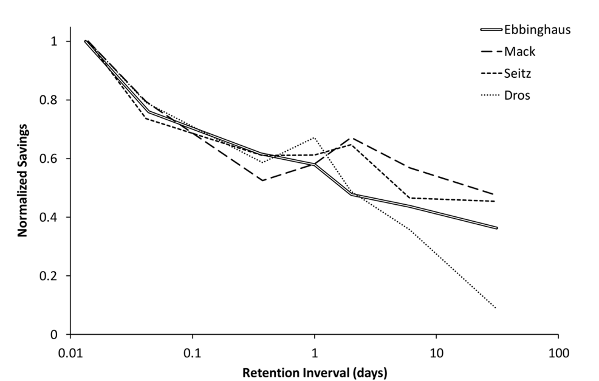
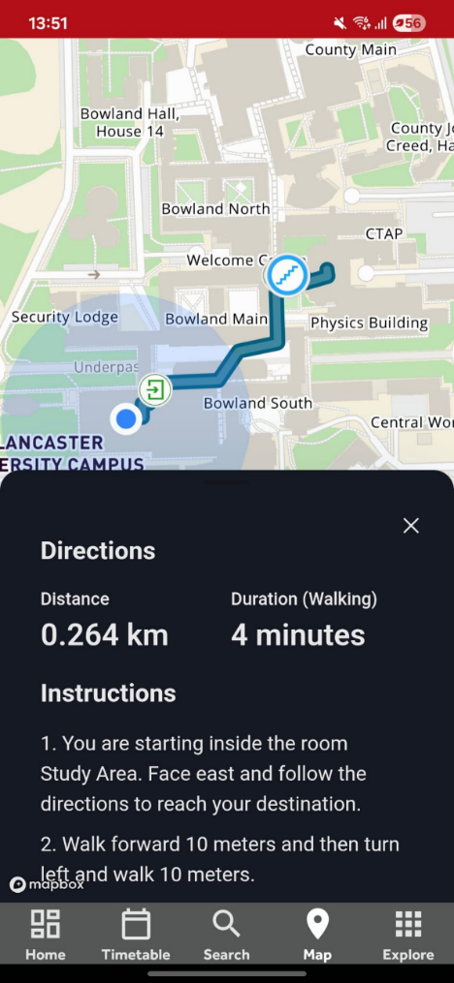
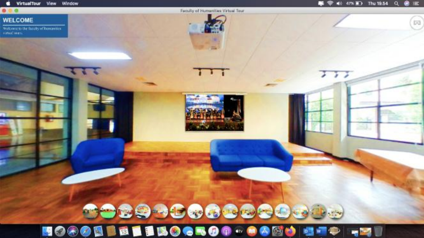
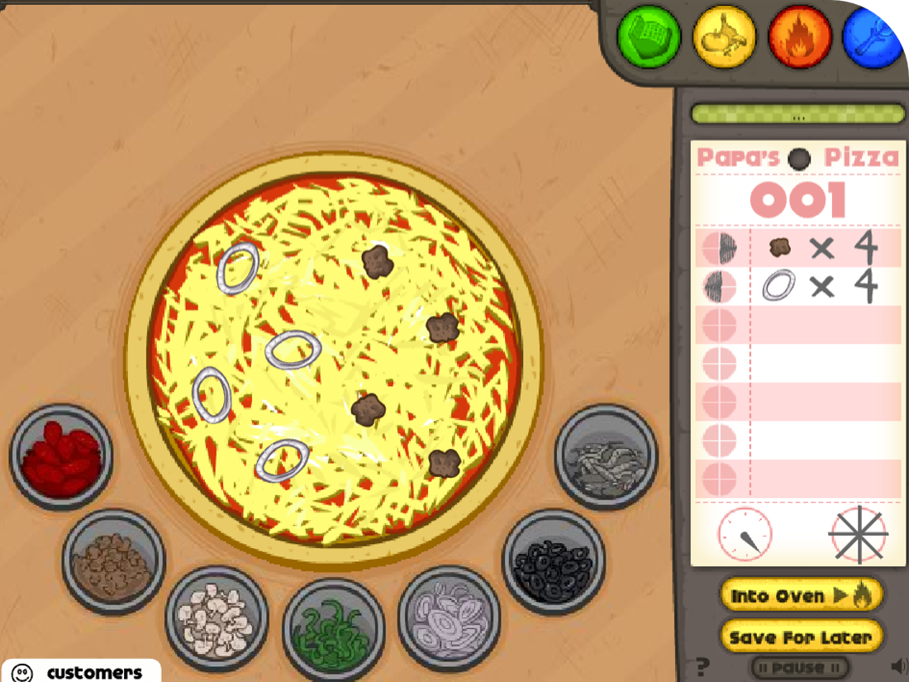
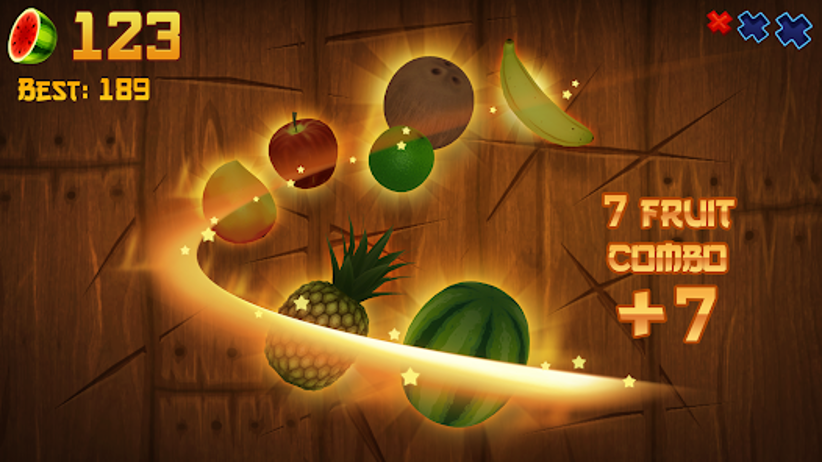
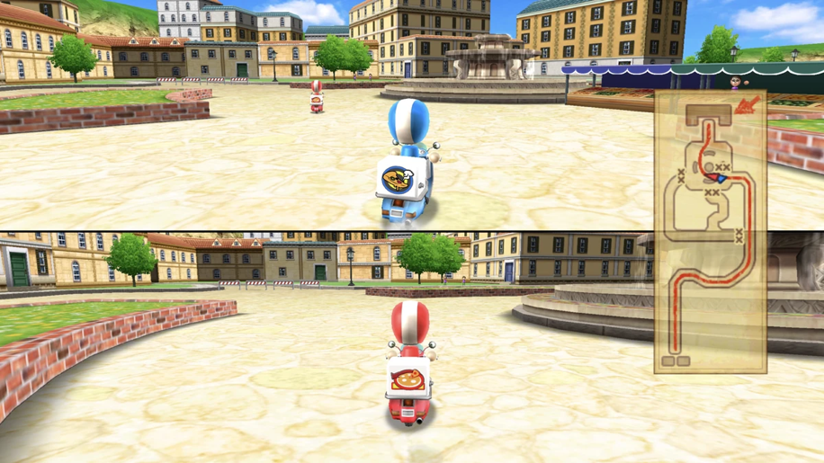
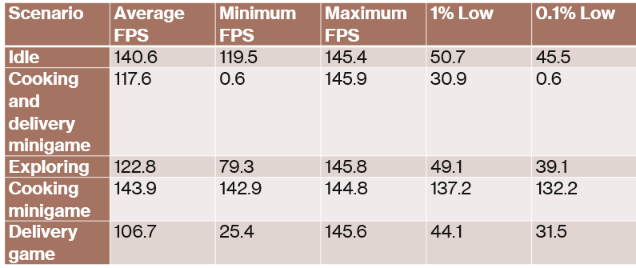
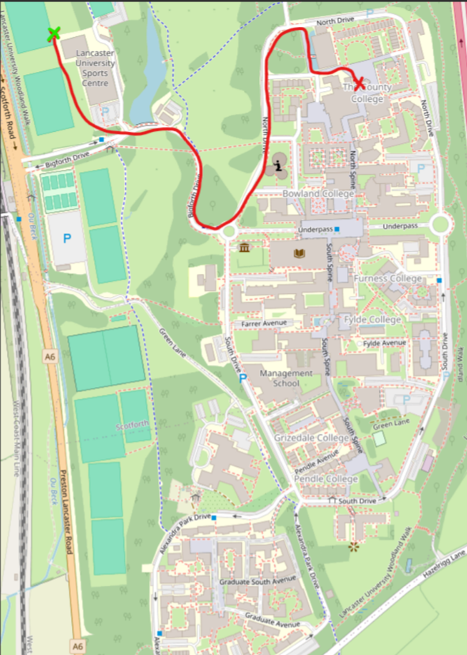
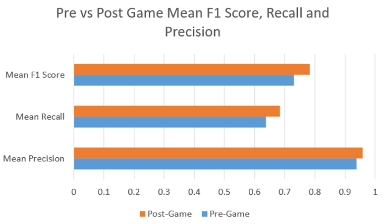
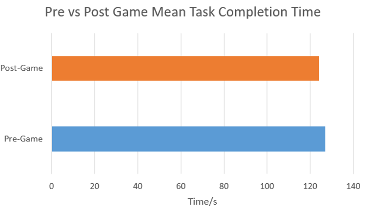

# Campus Navigation Game

### My dissertation project as part of my BSc (Hons) Computer Science degree from Lancaster University.
### Grade: A
### An open-world videogame set on the Lancaster University campus, designed to help incoming students learn the campus layout before arrival.

## Aims

- Create a videogame modelled on the Lancaster University campus
- Videogame should encourage repeated exploration of the virtual campus
- Leading to repeated exposure to campus landmarks
- Conduct a user study on the impact of the videogame on navigational ability

## Introduction

- Existing campus orientation techniques are flawed
- In person orientations in Welcome Week lead to information overload

 
- Students often rely on GPS systems to navigate

- Explored virtual campus tours as an alternative

  - These do not have any replay incentive
 
- Videogames were the solution
- Use implicit learning
  > (knowledge) acquired largely independently of the subject’s awareness of either the process of acquisition or knowledge base ultimately acquired

## Problem Statement

- The campus navigation game shall contain a 3D map modelled on Lancaster University campus.
- The map shall contain recognisable landmarks from the Lancaster University campus.
- The campus navigation game shall allow the player to control a character that can walk around the map.
- The campus navigation game shall include mechanisms that encourage the player to explore as much of the map as possible.
- The campus navigation game shall not focus on the map being a campus.

## Game Design

Much research and consideration went into each game design choice. 
A brief overview of some of these choices are in the following section

### Game Genre

- Open world vs Linear
- Chose open world, as this supports spatial memory of map
- BoTW and Stardew Valley researched as inspirations
- Farm life simulation loop of Stardew Valley provides structured exploration of the map
- Quests can also do this

### Perspective 

- 2D/HD2D does not match real perspective of student on campus
- 3D best option

### Art Style

- Pixel art not suited to 3D
- Low poly style chosen for:
  - Strong performance
  - Abundance of free models
  - Semi realistic, meaning game will reflect reality of campus
 
### Game Loop

- Aim to make game replayable, to ensure repeated exploration of campus
- Initial ideas of a student game loop, with dorm customisation
  - But I wanted the campus not to be the focus - learning should be implicit
 
- Cooking game with delivery service

### Landmarks

- Due to time constraints, the campus could not be modelled to perfection
- Subset of key landmarks should be modelled in more detail
- These were chosen on relevance and recognisability
- Used Blender

### Game Engine

- Choice between dedicated game engine vs a web framework
- Game engine provides ease of development and more complexity, compared to the performance of a web framework
- Initial testing done in Unity, but had to move to Godot due to licensing issues

### Cooking Minigame

- Need for replayability
- Customisation of restaurant came up as a possible idea
  - This takes too much time away from exploration
 
- Delivery system + short minigame settled on as best option
- Explored existing cooking games such as Overcooked and Papa's Pizzeria
- Simple but addictive

- Fruit Ninja another inspiration
  - Fast paced, leaving more time for exploration
  - Clear visual feedback
  - Combos

### Delivery Quest

- Inspiration from Wii Party
  - There is no direct use of GPS, forcing player to learn layout

- Provides structured navigation

### Replay Incentives

- Tools
- Recipes
- Vehicles

### Quests 

- NPCs make game feel full, like the real campus
- Quests from NPCs to unlock tools, recipes, vehicles
- Provide semi-structured exploration of the campus

### Inventory and Crafting

- Inspiration from Stardew Valley and Minecraft
- Provides more encouragement to explore map, as they have to find items to craft with

## Testing

Testing showed satisfactory performance with some stutter 

## Evaluation

### Evaluation Requirements

- Evaluate landmark recognition
- Evaluate navigational ability

### Evaluation Plan
- Users had to identify landmarks along a route, like in this picture

- They did multiple of these tasks before and after playing videogame
- See if videogame improves navigation

### Evaluation Metrics

- Measure precision, recall, F1
- Measure time taken
- Measure user experience
- Narration to see how navigation changed

### Results

- There was a slight increase in the metrics, suggesting landmark recognition and navigational ability improved
- However this could be the learning effect
- There was also a very small sample size of 2.

## Improvements

- System Usability Score (SUS) was only 50
- Most complaints were about the tutorial lacking
- More focus should have been on realistic campus modelling, rather than game features
  - My lack of Blender experience was a detracting factor

- Cooking minigame distracted from navigational tasks
  - Should have focused solely on parts of the game that force users to explore map

 
## Overall Takeaways

- Game partially met objectives
- Showed that the concept of a videogame for campus orientation is possible
- Could be developed further, with a more realistic map and polished mechanics
- Larger scale study needed to provide concrete results
- Game should be simplified and focused on navigation aspects

